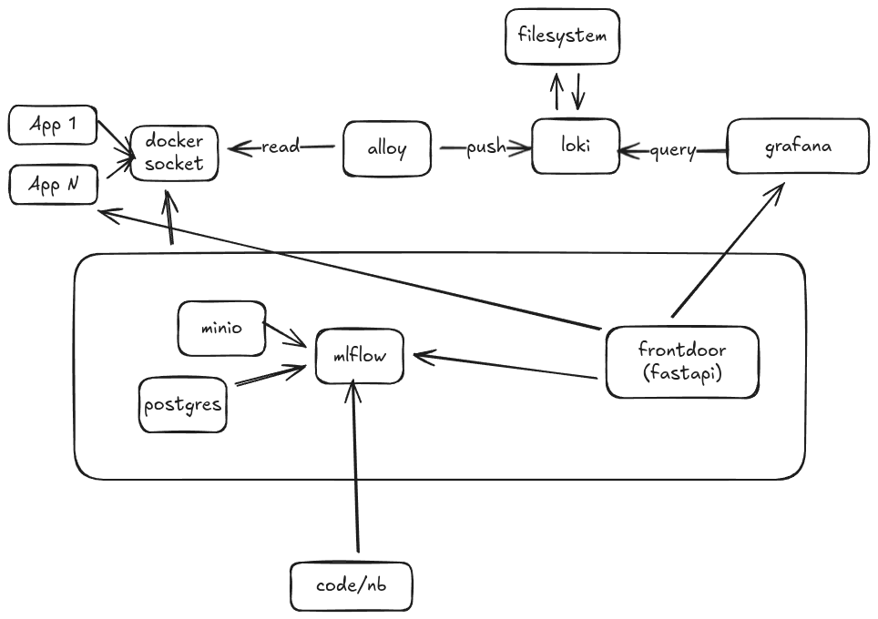

# Podrick

Local devops setup. 

Overview:

# Services 

## Mlflow 

Mlflow instance, using minio and postgres as dbs. 

## Observability 

Naive setup of Loki, Alloy, Grafana which tracks docker logs. 

### Loki 

- Data persisted with volume 
- Currently directly using file system... could be switch to minio?
- labels = categorisation of the log. 

### Alloy 

- 4 volumes. 
    - alloy config
    - docker socket
    - docker containers
    - alloy data volume 

### Grafana 

- 2 volumes 
    - settings
    - graphana volume

